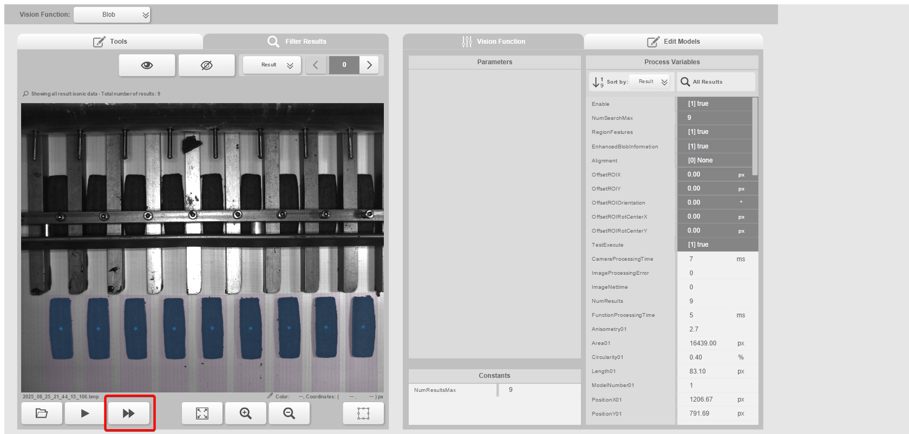

# FastForward Blob Checker

A lightweight GUI tool (Tkinter + Python) to analyze **FastForward camera CSV exports** and manage underperforming image results.  
It parses `.csv` logs generated by vision applications, compares the `BlobNumResults` column to an expected maximum, and then **logs, moves, or copies failed `.bmp` files** into a timestamped `failed/` subfolder.

---

## Features
- 📂 **CSV Analysis**: Parse `FastForward_<recipe>_<camera>.csv` files.
- 🔢 **Blob Check**: Compare `BlobNumResults` against an expected maximum.
- 🖼 **Image Management**:
  - Move (destructive) or Copy (non-destructive) under-max `.bmp` files.
  - Default **image source** = one folder above the CSV.
  - Default **failed folder** = same folder as the CSV.
  - Automatically creates `failed_<timestamp>/` subfolders.
- 📝 **Logging**: Generates a `failed_log_<timestamp>.csv` alongside the analyzed CSV.
- 🪟 **GUI**: Simple Tkinter interface, no command-line knowledge needed.
- 📦 **Portable EXE**: GitHub Actions builds a standalone `.exe` and `.zip` release for Windows users.

---

## Example
Generating the CSV file in Automation Studio



Analysis of CSV file


---

## Utilities

### `collect_failed.sh`
A helper script to consolidate results after multiple runs.

- Moves all `.bmp` files from timestamped `failed_YYYYMMDD_HHMMSS/` subfolders into a central `aggregate_failed/` folder.
- Removes the original `failed_YYYYMMDD_HHMMSS/` subfolders.
- Deletes any `failed_log*.csv` files in the current directory.

Usage (Linux/macOS, or Windows with Git Bash / WSL):
```bash
./collect_failed.sh
````

---

## Installation (Local Development)
Requires Python 3.10+ and Tkinter (bundled with Python).

```bash
git clone https://github.com/hevel86/ffCameraBlob.git
cd ffCameraBlob
pip install -r requirements.txt
python ff_blob_checker_gui.py
```

---

## Usage
1. Launch the GUI:
   ```bash
   python ff_blob_checker_gui.py
   ```
2. Select a `FastForward_<recipe>_<camera>.csv` file.
3. Enter the expected `BlobNumResults` (max).
4. Choose:
   - **Analyze (no move/copy)** → Just report results.
   - **Analyze & Execute** → Move/Copy under-max `.bmp` files.
5. Results appear in the log area; a CSV log is saved.

---

## Automated Windows Releases
This repo uses **GitHub Actions + PyInstaller** to publish portable Windows binaries.

- Tag a version (e.g., `v1.0.0`):
  ```bash
  git tag v1.0.0
  git push origin v1.0.0
  ```
- The workflow:
  - Builds a standalone `.exe` with PyInstaller.
  - Packages a `.zip` with the EXE, README, and LICENSE.
  - Publishes both as assets in the GitHub Release.

Find the latest release under:  
👉 [Releases](../../releases)

---

## Example Output
- `dist/ff_blob_checker_gui-1.0.0-windows-x64.exe`
- `dist/ff_blob_checker_gui-1.0.0-windows-x64-portable.zip`
- `failed_log_20250825_142033.csv` in the same folder as your CSV
- `failed/failed_20250825_142033/` containing under-max `.bmp` files

---

## License
MIT — see [LICENSE](LICENSE).
